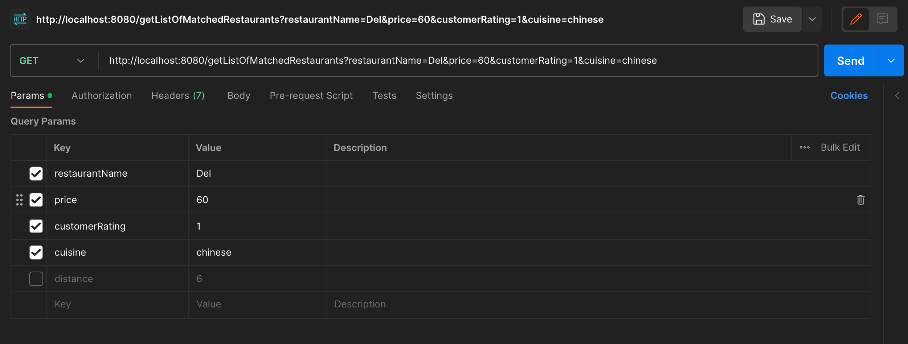

# Best Matched Restaurants Application

This is a Spring Boot application that provides an API for retrieving the best matched restaurants.

## Prerequisites

- Java 17
- Maven

## Getting Started

These instructions will get you a copy of the project up and running on your local machine for development and testing purposes.

### Installing

1. Clone the repository
```bash
git clone https://github.com/gustavofariaas/best-matched-restaurants.git
```
2. Open the project in your IDE

3. Run the commands to build the project and run.
```bash
mvn clean install
mvn spring-boot:run
```
4. The application will be running on http://localhost:8080
5. To run the tests, you can run the command below
```bash
mvn test
```

## How to run the API

1. To get the list of matched restaurants, you can use the following endpoint curl:
```bash
curl --location 'http://localhost:8080/getListOfMatchedRestaurants?restaurantName=Pal&price=60&customerRating=1&cuisine=Italian&distance=8'
```
2. If you have Postman, you can also use it to test the cURL command. Just import the collection file in the root of the project and run the request.

3. You can provide 5 parameters to the endpoint, parameters are not mandatory:

- restaurantName: The name of the restaurant
- price: The price of the restaurant 
- customerRating: The customer rating of the restaurant 
- cuisine: The cuisine of the restaurant
- distance: The distance of the restaurant 



## Notes about the project

1. I've decided to create a RESTAPI to help the user to find a restaurant.
2. The logic of the application starts at the class StartupLoadRestaurants, where once the app is initialized, it gets the data from the CSV provided and load into an H2 in-memory database.
3. After initialization, the data is already loaded and the app is ready to be used. Starting the tests with the curl, we have 5 parameters not mandatory to help the user to decide which restaurant matches with their preferences.
4. At first, the controller class is executed, where we have parameter validation using @Valid and BindingRequest, which will return to the client in case the parameter not matches with the validation.
5. Once validation is done, service class is called, and we load the restaurant data from RestaurantRepository, we can an outside query (query.orm.xml) and we store the data into a projection list.
6. Now, the app will call a method to filter the result according to the parameters received from the request, this filter is built using stream().filter() making it more readable.
7. Having the filtered data, the app call the transformer to transform the data from a list of projection to a list of DTO, to make it better for the sort part.
8. Now we need to sort the data according to what was asked in the Project. The priority of sort is -> distance -> customer rating -> price and the random decided will be the restaurant name.
8. In the sort, I've used List.sort with comparator.
9. After the sort, the service class will return to the controller the maximun of 5 results fromn the list of DTO. 


Built With:

- Spring Boot - The web framework used
- Maven - Dependency Management
- H2 Database - In-memory database
- Unit tests with JUnit, mockito.